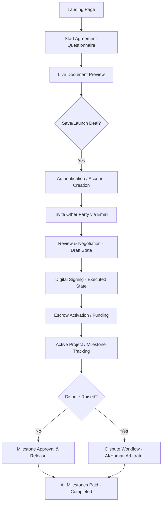

# SafeDeal MVP Product Specification

This document defines the core product scope, architecture, user journeys, and technical designs for the SafeDeal MVP. The objective is to build a structured, questionnaire-driven contract agreement and escrow system that integrates with the existing SafeDeal monolithic Go backend and React frontend.

---

## 1. Product Scope & MVP Boundaries

SafeDeal is a high-trust transaction platform that bridges structured legal agreements with secure escrow payments. The MVP focuses strictly on four core contract types, utilizing a structured questionnaire flow that automatically generates legally binding, printable agreements.

### 4 Core Contract Types
1. **Construction Contract**: Standard client-contractor agreement for building/renovation projects with milestone payments, material responsibility terms, and inspection windows.
2. **Freelance / Service Contract**: Standard independent contractor agreement with hourly/fixed pricing, IP assignment, sub-contracting permissions, and time-for-performance targets.
3. **Sales & Purchase Agreement**: Standard goods transaction agreement detailing itemized lists, quantities, risk of loss transfer points, and acceptance periods.
4. **Vehicle Bill of Sale**: Specific vehicle transfer document with fields for Make, Model, VIN, odometer readings, and "As-Is" disclaimers.

### The Arbitration Agreement (Different Treatment)
The Arbitration Agreement is **not** treated as a standalone fifth contract type. Instead, its clauses (confidentiality, jury trial waiver, costs, and terms of reference) are integrated directly into the core **Dispute Resolution & Arbitration Clause** of the 4 primary contracts. 
During contract creation, users select their dispute pathway, which maps directly to SafeDeal's on-platform resolution system (AI Arbitration, designated human mediator, or mutual resolution).

---

## 2. Complete User Journey

The MVP journey is designed for maximum conversion and trust. Users can start building their agreement before they are forced to authenticate.



### Steps in the Journey
1. **Landing Page**: Features a clean call-to-action (CTA): "Create an Agreement".
2. **Agreement Creation (Unauthenticated)**: The creator selects the transaction type and completes a guided questionnaire. A split-screen UI shows the legal document generating in real-time.
3. **Authentication (Just-in-Time)**: When the user clicks "Launch Deal & Send", they are prompted to Log In or Sign Up to save the draft.
4. **Invitation**: The creator specifies the other party's email. The system creates a placeholder user account if they don't exist and sends an email invitation.
5. **Review & Negotiation**: The invited party logs in and views the agreement dashboard. They can either accept the draft or propose adjustments (which resets the draft to edit mode).
6. **Digital Signing**: Both parties digitally sign by confirming their names and clicking "Sign". The contract is frozen (immutable) and transitions to `Executed`.
7. **Escrow Funding**: The buyer is prompted to fund the contract. Funds are held securely in escrow (on-chain via Sepolia ETH or off-chain via CBE/Chapa). State becomes `Active`.
8. **Execution & Release**: For milestone-based contracts (Freelance, Construction), the provider submits deliverables for each milestone, which the buyer accepts to release funds. For sales (Vehicle, Goods), the buyer confirms delivery to release the entire amount.
9. **Disputes**: If a milestone is rejected and negotiation fails, either party can raise a dispute, freezing the remaining escrow funds until resolved by the designated arbitrator or mutual agreement.

---

## 3. Structured Data Model & GORM Reuse

The MVP builds upon the existing GORM `Escrow` and `Milestone` models without altering the core schema. It utilizes the `ExtraData` JSONB field to store type-specific questionnaire data.

### 3.1 Common Contract Fields (Mapped to Columns)
- `ID` (uint): Unique identifier.
- `BuyerID` / `SellerID` (uint): References to GORM users.
- `MediatorID` (uint): Optional reference to designated arbitrator.
- `Amount` (uint): Total transaction budget.
- `Status` (string): Lifecycle state.
- `EscrowType` (string): `'item'` (for Sales/Vehicle) or `'project'` (for Freelance/Construction).
- `Title` / `Description` (string): Core contract summary.
- `DeliveryDate` (time.Time): Contractual completion target.
- `InspectionPeriod` (int): Number of days to review deliverables/goods.
- `Jurisdiction` / `GoverningLaw` (string): Legal framework defaults.
- `DisputeResolution` (string): Selected arbitration pathway.
- `GeneratedContract` (string): The raw, final generated contract text stored as an immutable snapshot.
- `ExtraData` (JSONB / text): Stores type-specific questionnaire fields as a structured JSON object.

### 3.2 Type-Specific JSON Schema (Stored in `ExtraData`)

#### Construction Specific:
```json
{
  "property_address": "123 Build Lane, Addis Ababa",
  "project_scope_details": "Excavation and foundation laying",
  "materials_included": ["cement", "bricks"],
  "materials_excluded_owner_responsibility": ["tiles", "paint"],
  "permits_responsibility": "contractor",
  "utility_responsibility_permanent": "owner",
  "utility_responsibility_temporary": "contractor",
  "liquidated_damages_per_day": 250,
  "general_liability_limit": 500000
}
```

#### Freelance Specific:
```json
{
  "service_deliverables_description": "Frontend UI components and Zustand store integration",
  "payment_structure": "fixed", 
  "billing_interval": "at_completion",
  "late_fee_amount": 50,
  "location_restrictions_allowed": false,
  "sub_freelancers_permitted": false,
  "portfolio_disclosure_allowed": true
}
```

#### Sales & Purchase Specific:
```json
{
  "itemized_goods": [
    {"name": "Industrial Sewing Machine", "quantity": 5, "description": "Model Singer 191D"}
  ],
  "risk_of_loss_holder": "seller",
  "risk_of_loss_transfer_point": "upon_delivery",
  "shipping_address": "456 Market St, Hawassa"
}
```

#### Vehicle Bill of Sale Specific:
```json
{
  "vehicle_make": "Toyota",
  "vehicle_model": "Corolla",
  "vehicle_type": "Sedan",
  "vehicle_vin": "1NXBR32E4FZXXXXXX",
  "vehicle_year": 2018,
  "vehicle_body_style": "4-Door",
  "vehicle_features": ["AC", "Leather Seats"],
  "vehicle_odometer_reading": 85000,
  "is_sold_as_is": true
}
```

---

## 4. Contract Lifecycle States

The agreement moves through deterministic states. No updates to the agreement data are allowed once both parties have signed.

| State | Allowed Operations | Allowed Transitions |
|---|---|---|
| **Draft** | Edit any fields, delete milestones, change parties. | `Ready for Review`, `Cancelled` |
| **Ready for Review** | View, reject (sends back to `Draft`), accept. | `Draft`, `Executed`, `Cancelled` |
| **Executed** | View, print, download. **Data locked.** Awaiting buyer deposit. | `Funded`, `Cancelled` |
| **Funded** / **Active** | Submit deliverables, view progress, initiate disputes. | `Milestone Under Review`, `Disputed`, `Completed`, `Cancelled` |
| **Milestone Under Review** | Inspect deliverables, approve, reject, initiate disputes. | `Active` (released/rejected milestone), `Disputed` |
| **Disputed** | Submit evidence, upload logs, resolve. **Funds frozen.** | `Completed` (release resolved), `Cancelled` (refund resolved) |
| **Completed** | Archive only. **ReadOnly.** | None (Terminal State) |
| **Cancelled** | Archive only. **ReadOnly.** | None (Terminal State) |

---

## 5. Contract Generation & Digital Signatures

SafeDeal generates formal HTML and plain text contracts from GORM database values. It does **not** use AI to write clauses. Instead, it injects structured parameters into static, pre-defined templates.

### Document Rendering Rules
1. **Dynamic Compilation**: The system reads the common metadata columns, pulls the type-specific variables from `ExtraData`, and injects them into the template placeholders.
2. **Dispute Resolution Clause**: Incorporates chosen arbitration terms (AAA rules, confidentiality rules, waiver of jury trial) based on selection.
3. **Milestone Schedule**: Formats milestones into a structured table inside Section 2 (Price & Payment).
4. **Digital Signatures**: The bottom of the document displays:
   - Creator Name, IP Address, and timestamp (`BuyerAcceptedAt` or `SellerAcceptedAt`).
   - Counterparty Name, IP Address, and timestamp.
   - A unique SHA-256 **Contract Fingerprint Hash** computed from the stable JSON state of the contract.

---

## 6. Escrow & Milestones Integration

The contract acts as the binding framework that governs the escrow release logic.

```
Contract (GORM Escrow)
  │
  ├──► Obligations (GORM Obligations) -> Specifies who performs what
  │
  ├──► Milestones (GORM Milestones)   -> Sets payment allocations
  │     │
  │     ├──► Pending  (Awaiting funding)
  │     ├──► Funded   (Funded by buyer)
  │     ├──► Submitted (Deliverable URL uploaded by seller)
  │     ├──► Approved (Buyer approved -> Triggers blockchain/fiat release)
  │     └──► Disputed (Rejection disputed -> Freezes milestone fund)
  │
  └──► Escrow Ledger (Chapa / Blockchain Tx) -> Moves actual funds
```

### Flow Rules
1. **Escrow Emergence**: Escrow is created automatically as part of the contract initialization. The GORM `Escrow` model represents both the legal contract metadata and the escrow funding state.
2. **Blockchain Sync**: If the blockchain client is connected, the Go backend initiates `CreateEscrow` on the Ethereum smart contract upon transitioning to the `Executed` state.
3. **Fiat Verification**: For bank transfers (CBE) or Chapa webhook captures, the payment updates the escrow status to `Funded` and marks all milestones as `MilestoneFunded` (ready for provider performance).
4. **Disbursements**: Funds are released milestone-by-milestone upon explicit approval (`PUT /api/v1/milestones/:id/approve`), which calls the payment module to disburse funds.

---

## 7. Arbitration & Dispute Resolution Integration

SafeDeal connects contract clauses to on-platform resolution workflows:

### Dispute Workflow Connection
1. **Clause Enforcement**: During creation, if the parties choose `AI Arbitration via SafeDeal`, they contractually agree to bind themselves to the output of SafeDeal's AI Arbitrator.
2. **Dispute Invocations**: When a party calls `POST /api/v1/escrows/dispute/:id`, remaining funds are locked and the state transitions to `Disputed`.
3. **AI Dispute Handler**:
   - The AI Arbitrator service (Gemini API) reads the contract title, description, milestones, submitted deliverables, chat logs, and the dispute reason.
   - It outputs a binding split/release/refund judgment.
4. **Human Mediator / Arbitrator**:
   - If a designated human arbitrator is chosen during contract creation, their email/address is saved in the contract's `MediatorID`.
   - Only this user has permission to call `POST /api/v1/escrows/dispute/:id/resolve` to split or release the frozen funds.

---

## 8. Versioning & Amendments

To prevent fraud, executed contracts cannot be edited.
- **Amendments**: If the parties mutually agree to modify an active project (e.g. adding a new milestone or changing the price), they must create an "Amendment".
- **Amendment System**: An Amendment is a new contract draft with `ContractVersion = "1.1"` (or incremented), which copies the active contract's fields, applies changes, and references the original contract ID.
- **Activation**: The Amendment must be signed by both parties. Once signed, the original contract is closed as `Cancelled (Superseded)`, and the funds are transferred to the new active version.
